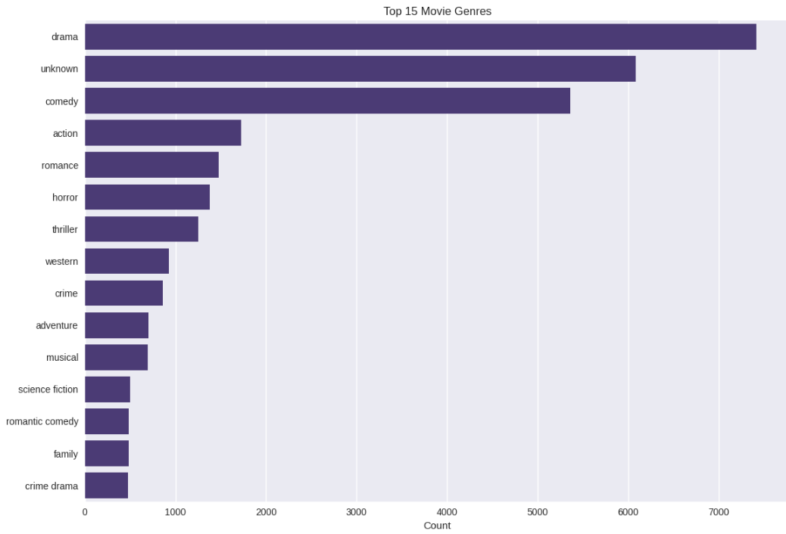
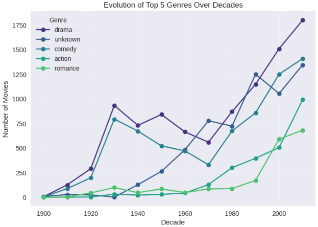
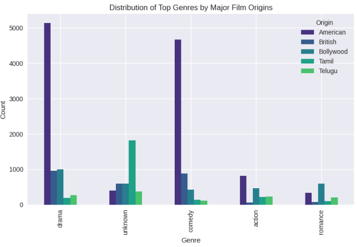
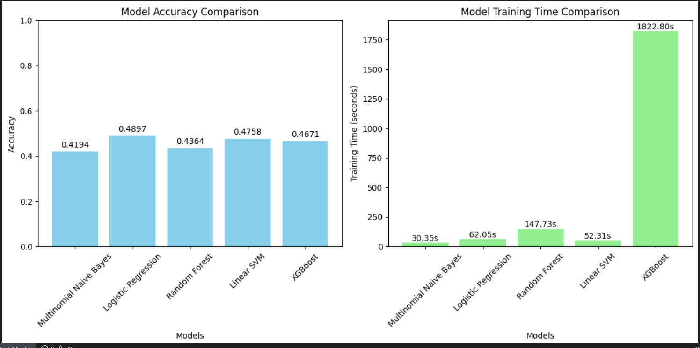
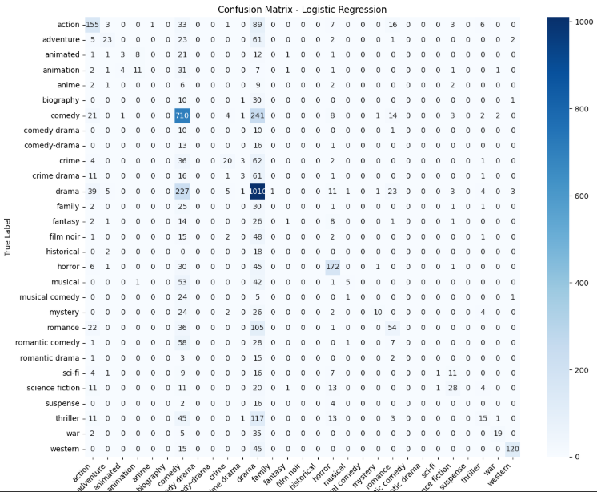

# Movie_Genre_classification
Machine Learning project predicting movie genres from Wikipedia plot summaries using TF-IDF. Benchmarks Logistic Regression, SVM, Naive Bayes, Random Forest &amp; XGBoost with accuracy and training time comparisons.

# Dataset & Preprocessing

**Source:** Kaggle Wikipedia movie plots

**Preprocessing:**
- Dropped rows missing plot/genre/director/title/origin
- Removed “unknown” genres
- Kept only genres with ≥100 samples
- Combined text fields (Title + Plot + Director + Origin → `CombinedText`)
- Applied Label Encoding
- TF-IDF vectorization (unigrams + bigrams, max_features=10,000, stop_words='english')

# Exploratory Data Analysis (EDA)
The EDA highlights trends in movie genres over time and across regions.
**Top Movie Genres**
A bar chart showing the most prevalent genres:

Drama leads, followed by unknown, comedy, action, romance, horror, thriller, western, crime, adventure, musical, science fiction, romantic comedy, family, and crime drama.

**Evolution of Top Genres Over Time**
A line graph tracking genre popularity from 1900 to 2000:

Drama shows significant growth, peaking in the late 20th century.
Comedy, action, and romance maintain steady popularity.
A notable spike in drama around 1923 may reflect cultural or cinematic influences.

**Distribution of Top Genres by Major Film Origins**
A clustered bar chart analyzing genres by origin (American, British, Bollywood, Tamil, Telugu):

American films dominate drama production.
British films contribute with distinct narrative styles.
Bollywood, Tamil, and Telugu industries add cultural diversity, especially in drama.

# Model Comparison
Best Model: Logistic Regression (48.97% accuracy)

Visualizations: Bar charts for accuracy and training time; confusion matrices.

# Results and Conclusions

Logistic Regression achieved the highest accuracy but has moderate training time.
Challenges: As this was a project of my academic ML course, I was bound to use only ML model but 49% accuracy indicates room for improvement, possibly with advanced NLP (like BERT) or multimodal data.
Confusion matrices show strength in major genres (drama, comedy, action) but weaknesses in others.
Future Work: Explore multimodal features (trailers, posters) or deep learning models.
